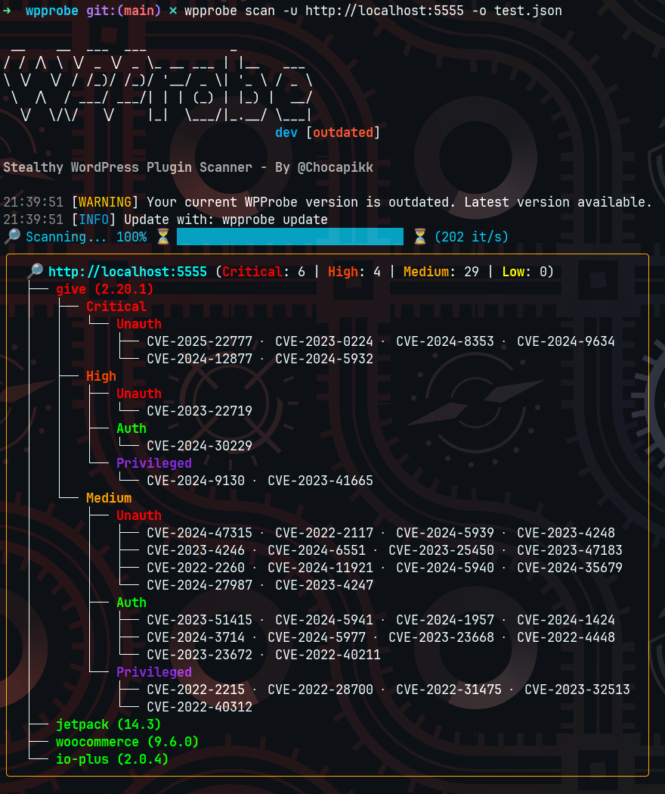

# 🔎 WPProbe – The Stealthy WordPress Scanner  

**"Because why scan blind when WordPress exposes itself?"**  

---



## 🧐 What is WPProbe?  

**WPProbe** is a **fast and efficient WordPress plugin scanner** that leverages **REST API enumeration (`?rest_route`)** to detect installed plugins **without brute-force**.  

Unlike traditional scanners that hammer websites with requests, WPProbe takes a smarter approach by querying the exposed REST API. This technique allows us to **identify plugins stealthily**, reducing detection risks and **speeding up the scan process**.  

📌 **Currently, over 900 plugins** can be identified using this method!  

---

## 🚀 How It Works  

1️⃣ **Fetch** a list of known WordPress plugins from a precompiled database (Wordfence).  
2️⃣ **Scan** the target site for exposed REST API routes (`?rest_route=/`).  
3️⃣ **Match** the discovered endpoints with known plugin signatures.  
4️⃣ **Retrieve** the installed version (when possible) by extracting metadata from files like `readme.txt`.  
5️⃣ **Correlate** detected plugins with publicly known vulnerabilities (CVE mapping).  
6️⃣ **Output** the results in a structured CSV format, making post-processing easy.  

🔥 **This means fewer requests, faster scans, and a lower chance of getting blocked by WAFs or security plugins!**  

---

## ⚙️ Features  

✅ **Stealthy detection** – No need to brute-force plugins; just ask WordPress nicely.  
✅ **High-speed scanning** – Multithreaded scanning with a sleek progress bar.  
✅ **Vulnerability mapping** – Automatically associates detected plugins with known CVEs.  
✅ **CSV output** – Structured output for easy analysis and reporting.  
✅ **Resilient scanning** – Handles sites with missing version info gracefully.  

---

## 📌 Limitations  

🔹 Some plugins don’t expose REST API endpoints, making them undetectable via this method.  
🔹 If a plugin is outdated, disabled, or hidden by security plugins, it may not be detected.  
🔹 The technique relies on a predefined plugin-to-endpoint mapping, which is regularly updated.  

---

## 🔧 Installation

### Option 1️⃣ (Quick setup via `go install`)

```bash
go install github.com/Chocapikk/wpprobe@latest
```
- **Requires Go 1.22+**  
- Ensure `$(go env GOPATH)/bin` is in your `$PATH`  

### Option 2️⃣ (Manual build)

1. **Clone the repository**  
   ```bash
   git clone https://github.com/Chocapikk/wpprobe
   cd wpprobe
   ```
2. **Install dependencies**  
   ```bash
   go mod tidy
   ```
3. **Build the binary**  
   ```bash
   go build -o wpprobe
   ```
   Move or copy `wpprobe` into a directory listed in your `$PATH`.

### Option 3️⃣ (Docker)
1. **Build Image**
   ```bash
   docker build -t wpprobe .
   ```
2. **Run**
   ```bash
   docker run -it --rm wpprobe
   ```

---

## 🕵️ Usage  

**Update the local Wordfence DB first:**  
```bash
./wpprobe update
```

**Basic scan for a single website:**  
```bash
./wpprobe scan -u https://example.com
```

**Scan multiple targets from a file with 200 concurrent threads:**  
```bash
./wpprobe scan -f targets.txt -t 200
```

**Save results to a CSV file:**  
```bash
./wpprobe scan -f targets.txt -t 200 -o results.csv
```

## 📜 Example Output (CSV)  

```
URL,Plugin,Version,Severity,CVEs
https://example.com,elementor,3.11.2,High,"CVE-2023-48777, CVE-2024-24934"
https://example.com,wordpress-seo,19.12,Medium,"CVE-2023-40680, CVE-2024-4984, CVE-2024-4041"
https://example.com,woocommerce,7.4.0,Medium,"CVE-2023-47777, CVE-2024-39666, CVE-2024-9944"
```

---

## 🎯 Why WPProbe?  

💡 **The idea behind WPProbe** comes from the realization that **WordPress exposes plugin data through its REST API (`?rest_route`)**. Instead of wasting time brute-forcing plugin paths, this tool **matches REST endpoints with known plugin signatures**, allowing for faster and more stealthy scans.  

**Over 900 plugins** are currently detectable using this method, making WPProbe one of the most effective tools for WordPress reconnaissance.  

---

## 🤖 Future Improvements  

🛠️ **Expanding the plugin database** – More plugins, better detection.  
⚡ **Adding more fingerprinting techniques** – Beyond REST API, integrating alternative detection methods.  
📊 **Enhanced reporting** – JSON output and integration with security dashboards.  

---

## ✨ Credits  

Developed by **@Chocapikk** 🍫, inspired by modern recon methodologies and the **REST API enumeration trick**.  

👀 Stay stealthy, scan smart! 🚀